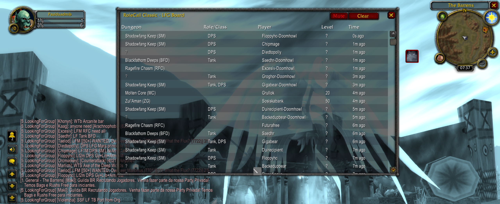

# RoleCall Classic

**"See the groups. Skip the spam."**

RoleCall Classic is a World of Warcraft Classic addon that parses LFG-related chat messages into a clean, readable board — without automation, without breaking Classic rules, and without clutter.

Designed for **The Burning Crusade Classic Anniversary** servers.



## Quick Start

1. Copy the folder to your WoW Classic AddOns directory: `C:/Program Files (x86)/World of Warcraft/_classic_/Interface/AddOns/`
2. Rename the copied folder to `RoleCall` so it matches the manifest filename `RoleCall.toc`.
3. Ensure the files are directly inside `RoleCall` (no extra nested folder).
4. On the character select screen, click AddOns and enable "Load out of date AddOns" if needed.
5. Reload UI or restart WoW.
6. Type `/rolecall` (or `/rcc`) to toggle the RoleCall board.

## Features

### Core MVP Features (Implemented)

- ✅ **Chat Parsing Engine** — Extracts dungeon, roles, level, LFM/LFG intent from chat messages
- ✅ **LFG Board UI** — Clean, scrollable board with Dungeon, Roles, Player, Level, and Time columns
- ✅ **Smart De-Duplication** — Collapses reposts by the same player, increments counter, refreshes timestamp
- ✅ **Whisper Templates** — Click any entry to prefill a contextual whisper (fully manual, Classic-compliant)
- ✅ **Event Monitoring** — Listens to LookingForGroup and Trade channels
- ✅ **Zero Configuration** — Works immediately after loading
- ✅ **Quiet Mode (Notify/Mute)** — Toggle chat notifications while entries continue to populate the board

### Dungeon Support

Recognized dungeons with aliases:

- BRD (Blackrock Depths)
- Strat / Strat Live / Strat UD (Stratholme)
- Scholo (Scholomance)
- UBRS (Upper Blackrock Spire)
- DM / DM-N / DM-E / DM-W (Dire Maul)
- SM Cath / SM Armory / SM Library / SM Graveyard (Scarlet Monastery)
- BFD (Blackfathom Deeps)
- Wailing Caverns
- Uldaman
- Ragefire Chasm

## Project Structure

```
RoleCall/
  RoleCall.toc      -- Addon manifest
  Core.lua          -- Event handling, chat capture, slash commands
  Parser.lua        -- Message parsing and intent extraction
  UI.lua            -- Board frame with scrolling, sorting, entry rows, rendering
  Whisper.lua       -- Whisper template generation
  Data.lua          -- In-memory session storage
  Minimap.lua       -- Minimap button for quick access
  README.md         -- This file
```

## TODO

### Phase 2: TBC-Specific Features 🔜

- [ ] Normal / Heroic / Attunement tags in parser
- [ ] Role scarcity highlighting (highlight high-demand roles)
- [ ] Dungeon-specific role presets
- [ ] TBC dungeon aliases (Blood Furnace, Shattered Halls, Slave Pens, etc.)

### Quality-of-Life Enhancements 🔜

- [ ] Optional role filter (show only Tank, Healer, DPS posts)
- [ ] Optional dungeon filter (dropdown or checkboxes)
- [ ] Age-based fading of entries (older = more transparent)
- [ ] Compact vs expanded UI modes
- [ ] Configurable max entry age before auto-pruning
- [ ] Option to auto-hide boosting/selling messages
- [ ] Column width customization
- [ ] User-extensible dungeon abbreviations

### Whisper Template Improvements 🔜

- [ ] Smart template context (e.g., "have key" for BRD)
- [ ] Remember recent whisper templates
- [ ] Customizable template presets per role

### Performance & Stability ✅

- [x] Entry pruning on excessive backlog (prevent memory bloat)
  - Automatic: Entries older than 10 minutes are pruned every 60 seconds
  - Manual: "Clear Board" button for instant clearing of all entries
- [x] Error handling with graceful fallback
- [x] Board controls (Notify/Mute, Clear)

### CurseForge Release ✅

- [x] Create release notes and changelog ([CHANGELOG.md](CHANGELOG.md))
- [x] Set up license ([LICENSE](LICENSE))
- [ ] Generate/collect screenshots:
  1. Raw LFG chat spam
  2. Clean RoleCall board
  3. Whisper template preview
- [x] Version set to 0.2.0 in manifest
 - [ ] Automate packaging/upload via GitHub Actions (BigWigs packager)

### Open Design Questions

- How aggressive should repost collapsing be? (Current: any re-message = +1 repost)
- Should boosting/selling messages be auto-hidden or flagged?
- Should dungeon abbreviations be user-extensible?

## API Compliance

- ✅ TBC Classic Anniversary API compliant (Interface 20505)
- ✅ No external dependencies
- ✅ No automation (fully manual, fully legal)

## Installation

### From CurseForge

1. Visit the [RoleCall Classic CurseForge page](https://www.curseforge.com/wow/addons/rolecall-classic)
2. Download the latest version
3. Extract to your WoW Classic AddOns folder: `C:/Program Files (x86)/World of Warcraft/_classic_/Interface/AddOns/`
4. Ensure the folder is named `RoleCall` (not `rolecall-classic`)
5. Reload UI or restart WoW

### Manual Installation

- Folder name must match the `.toc` filename. This addon's manifest is `RoleCall.toc`, so the folder must be named `RoleCall`.
- Final path should look like: `.../Interface/AddOns/RoleCall/` with these files inside: [RoleCall.toc](RoleCall.toc), [Core.lua](Core.lua), [Parser.lua](Parser.lua), [UI.lua](UI.lua), [Whisper.lua](Whisper.lua), [Data.lua](Data.lua), [Minimap.lua](Minimap.lua).
- If the addon does not appear in the AddOns list, double-check for an extra nested folder (e.g., `RoleCall/rolecall-classic/`), and move files up one level.
- If your client's Interface number is newer than `20504`, toggle "Load out of date AddOns" to allow loading until the manifest is updated.

## Development Notes

### Data Model

Entries stored in-memory with the following structure:

```lua
entry = {
  player = "Grimgar",
  dungeon = "BRD",
  roles = {
    tank = true,
    healer = false,
    dps = false
  },
  level = 58,
  lfm = true,
  timestamp = time(),
  reposts = 2
}
```

### Monitored Events

- `CHAT_MSG_CHANNEL` — Trade, LookingForGroup
- `CHAT_MSG_SAY` — Local say
- `CHAT_MSG_YELL` — Local yell
- `ADDON_LOADED` — Initialization

### Slash Commands

- `/rolecall` or `/rcc` — Toggle board visibility

## Board Controls

- **Notify/Mute** — Toggle chat notifications; new entries still appear on the board
- **Clear** — Remove all entries from the board instantly
- **Draggable Title Bar** — Reposition the board anywhere on screen
- **Resizable** — Drag the bottom-right corner to resize
- **Sortable Columns** — Click column headers to sort by Dungeon, Roles, Player, Level, or Time
- **Click-to-Whisper** — Click any entry to prefill a contextual whisper

## Design Philosophy

- **Reduce spam, not replace chat** — Board is supplementary, not authoritative
- **Zero configuration** — Works out-of-the-box
- **Fully Classic-legal** — No automation, no matchmaking, fully manual
- **Minimal visual noise** — Clean columns, no unnecessary UI chrome
- **Scales to TBC** — Extensible design for heroics and attunements

## Contributing

**RoleCall Classic is open-source!** We welcome issues, bug reports, and pull requests.

### Links

- **GitHub Repository**: [paulgiuliano/rolecall-classic](https://github.com/paulgiuliano/rolecall-classic)
- **Issue Tracker**: [GitHub Issues](https://github.com/paulgiuliano/rolecall-classic/issues)
- **Discussions**: [GitHub Discussions](https://github.com/paulgiuliano/rolecall-classic/discussions)

### How to Contribute

1. **Report bugs** — Found an issue? [Open an issue](https://github.com/paulgiuliano/rolecall-classic/issues/new) with details
2. **Request features** — Have an idea? [Start a discussion](https://github.com/paulgiuliano/rolecall-classic/discussions) or open a feature request
3. **Submit code** — Fork the repo, make changes, and submit a pull request
4. **Improve docs** — Documentation improvements are always welcome

### Design Philosophy

When contributing, please maintain:
- **Classic compliance** — No automation, no matchmaking, fully manual
- **Zero configuration** — Features should work out-of-the-box
- **Minimal visual noise** — Keep the UI clean and readable
- **Performance focus** — Consider memory and CPU impact

## License

MIT License — See [LICENSE](LICENSE) file for details.

This addon is free to use, modify, and distribute under the terms of the MIT License.

## Support

Enjoying RoleCall Classic? Totally optional, but in-game gold tips are appreciated!

- Contact: laz0rviking#1397
- Character: Dunemule (Dreamscythe)
